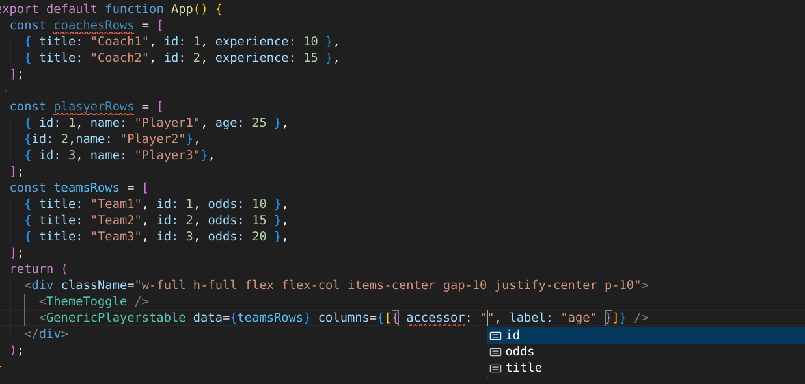

## Generic components process

to go from a fully
[hardcoded componenst](simple-app/src/components/HardCodedTable.tsx) to a
[more dynamic one](simple-app/src/components/DynamicRowsTable.tsx) we first put
the tables rows into an array and then pass that array to the component which we
loop over to get the table rows

<video controls src="docs/rows-to-mapped-rows.mp4" title="rows-to-mapped-rows"></video>

And the same can also be done to
[the columns](simple-app/src/components/DynamicRowsAndColumnsTable.tsx)

<video controls src="docs/static-to-dynamic-coumns.mp4" title="static-to-dynamic-coumns"></video>

and now our table mponent can take in the data and the columns and then render
the table rows and columns

```tsx
type Player = {
  id: number;
  name: string;
  age: number;
  rank: number;
}

type TableColumn = {
  label: string;
  accessor: keyof Player;
};
interface DynamicPlayerstableProps {
  columns: Array<TableColumn>;
  data: Array<Player>;
}

export function DynamicPlayerstable({data,columns}: DynamicPlayerstableProps) {
    return ....
}
```

Our [players table component](simple-app/src/components/DynamicPlayersTable.tsx)
is now decoupled from the data but we can take this further by decouping it from
the shape of data. In it's current form it requires us to pass in data like this

```tsx
const columns: Array<TableColumn> = [
    { label: "ID", accessor: "id" },
    { accessor: "name", label: "Name" },
    { accessor: "age", label: "Age" },
    { accessor: "rank", label: "Rank" },
];

const data: Array<Player> = [
    { id: 1, name: "Player1", age: 25, rank: "Silver" },
    { id: 2, name: "Player2", age: 30, rank: "Gold" },
    { id: 3, name: "Player3", age: 22, rank: "Bronze" },
    { id: 4, name: "Player4", age: 28, rank: "Platinum" },
    { id: 5, name: "Player5", age: 24, rank: "Diamond" },
    { id: 6, name: "Player6", age: 27, rank: "Silver" },
    { id: 7, name: "Player7", age: 29, rank: "Gold" },
];
return <DynamicPlayerstable columns={columns} data={data} />;
```

The table structure is dynamic enough to accomodate any array of objects we pass
in with the only required field being od `id` because we use it as the key to
every row

```tsx
<tbody>
    {data.map((player) => (
        <tr key={player.id}>
        {columns.map((column) => (
            <td key={column.accessor}>{player[column.accessor]}</td>
            ))}
        </tr>
    ))}
</tbody>;
```
To accomplish this we'll need to use a generic type usuaally maerked as `T` which is a way to pass in variables to out types and interfaces

firdt we pass it into the component 
```tsx
export function DynamicPlayerstable<T>({data,columns}: DynamicPlayerstableProps)
```
then we pass it into our parameter interface

```tsx
interface DynamicPlayerstableProps<T> {
  columns: Array<TableColumn>;
  data: Array<Player>;
}

export function DynamicPlayerstable<T>({data,columns}: DynamicPlayerstableProps<T>) 
```
this type `T` should be the type of the object that we pass in to the array so we can now replace type `Player` with `T`

```tsx
interface DynamicPlayerstableProps<T> {
  columns: Array<TableColumn>;
  data: Array<T>;
}
```
our `TbaleColumn` type was also relying on the type `Player` so the type is also going to change to `TableColumn<T>` so we can now replace type `Player` with `T`

<video controls src="docs/type-Player-to-T.mp4" title="type-Player-to-T"></video>

At this point typescipt will be able to give us auto complete for the coluns field based on what type `T` is based on the array we pass into the data field 

with player rows array

with teams row array



Out component is working fine from the outside but typescript is having a hader time understanding the types inside the component sine generice type `T` could be any type and it's keys could be `numver|string|symbol` , `symbols` aren't allowed as react keys so we can narrow that type by using an intersection `&` to inform typescrpt that the keys of T must be a string like we had in type `Player`

```tsx
type TableColumn<T> = {
  label: string;
  accessor: keyof T & string;
};
interface DynamicPlayerstableProps<T> {
  columns: Array<TableColumn<T>>;
  data: Array<T>;
}
```
That resolves that issue but introduces another one where typescipt doesn't know what type `T` is and what type `T[keyof T]` is going to resolve to

Because in it's current shape bothe 

```tsx
type Player = {
  id: number;
  name: string;
  age: number;
  rank: string;
}
//  and

type playeyWithArrays = {
  id:Array<number>;
  name:Array<string>;
  age:Array<number>;
  rank:Date;
  ratio:{
    numerator:number;
    denominator:number;
  }
}
```

can all be passed into the component as type `T` , react and our table doesn't expect that and will throw an error if we try to render an array or `Date` object na  `td` or any react node . so to further specify what inputs we expect we can use the `extends` operator
in typescript it's either used to inherit behaviour from a class or to mark a generic type as a subtype of another more specific type

```tsx
type TableColumn<T extends Record<string, string|number >> = {
  label: string;
  accessor: keyof T & string;
};
interface GenericTableProps<T extends Record<string, string|number >> {
  columns: Array<TableColumn<T>>;
  data: Array<T>;
}

export function GenericTable<T extends Record<string, string|number >>
```
now with this we can only pass in objects that have string or number keys

```tsx
 const data = [
  {
    id: 1,
    name: "John Doe",
    age: 30,
    rank: "Gold",
  },

 ]
 const baddata = [
  {
    id: 1,
    name: "John Doe",
    age: [30],
    rank: new Date(),
  },

 ]
```
before restrictions

after restrictions


one last thing is rqeire type `T` to include a key `id` because it's going to be used as the key for the table rows

```tsx
type GenericItem = Record<string, string | number > & { id: string };  // field of id:string required in passed in objects
type TableColumn<T extends GenericItem> = {
  label: string;
  accessor: keyof T & string;
};
interface GenericTableProps<T extends GenericItem> {
  columns: Array<TableColumn<T>>;
  data: Array<T>;
}

export function GenericPlayerstable<T extends GenericItem>({
  data,
  columns,
}: GenericTableProps<T>) 
```


